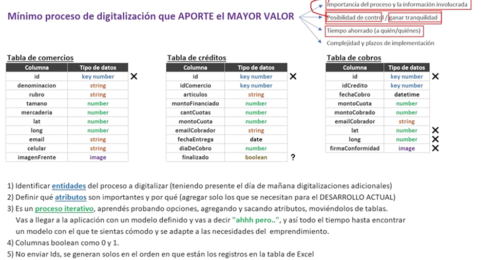
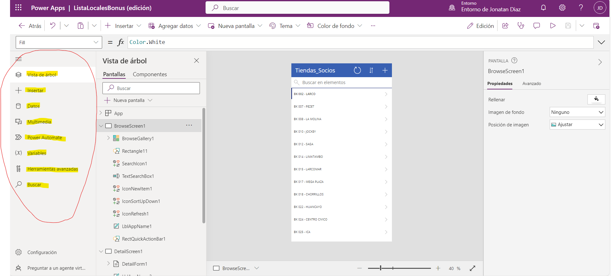
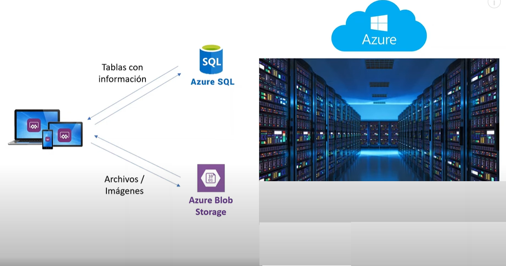

# CURSO DE POWER APPS - YOUTUBE - @Martín Gesualdo

>Entregue aplicaciones insertadas con inteligencia artificial para modernizar rápidamente sus aplicaciones y sistemas heredados. Empiece a trabajar desde una tabla, un boceto, una frase o su propio código y cree soluciones a su gusto.

Mínimo proceso de digitalización que APORTE EL MAYOR VALOR:
•	Importancia del proceso y la información involucrada
•	Posibilidad de control / ganar tranquilidad
•	Tiempo ahorrado (a quien y a quienes)
•	Complejidad plazos de implementación



[Link de power Apps:](https://make.powerapps.com/environments/5c0208ef-96c5-e502-ad9e-5d99cbd011e7/home?utm_source=office&utm_medium=app_launcher&utm_campaign=office_referrals )


### Usando Power APPS

* Se carga siempre la app, con data de Excel en tablas.

### Recorriendo el panel de edición

* Porque crear aplicaciones?
    * Facilitar la comunicaicón entre usuario y uno o varios origenes

* POWER APPS Permite:
  1. Crear
  2. Consultar
  3. Editar
  4. Eliminar

#### PANEL DE EDICIÓN:

1. **VISTA DE ÁRBOL**
   1. APP
   2. BrowseScreen1: Qué asu vez tienen otros elementos dentro por ejemplo:
   3. DetailScreen1:
   4. EditScreen1:
   
A partir de esos objetos se puede hacer lo siguiente:
1) Diseño
2) Datos a mostrar
3) Respuesta a eventos

Hay varios tipos de objetos:
1) Icono
2) Etiqueta

En POWER APPS:
* Ctrl + z = Atras
* Ctrl + y = Adelante
  
#### TODAS LAS OPCIONES DEL PANEL



### BASE DE DATOS en la NUBE! AZURE  ☁




* Función de power app para capturar fecha y hora Now

```SQL
Use powerApps;
CREATE TABLE tblObjetos (
id int primary key identity(1,1),
tipo varchar(40),
marca varchar(40),
modelo varchar(40),
aclaraciones varchar(400),
usuarioCarga varchar(40),
fechaCrecacion datetime

SELECT * FROM tblObjetos
```

# CREANDO UNA APP PARA REGISTRO DE VACACIONES

1. Crear primero las tablas en sharepoint

* **Función** para navegar por pantallas:
  * Navigate(ScrNewRecord;ScreenTransition.Fade)
  * 
2. **Función**
   * Para regresar Back()
  
3. **Formulario de edición**
   * Uno de los más usados en power apps: Se agrega la tabla conectada a shareponit en este caso, y para quitar columnas inecesarias en la vista de árbol se suprimen los campos:
  
* En avanzado desbloquear para poder insertar datos.


* Función para llamar al usuario de correo:
  * User().FullName

* Calculando los días totales, función:

#### Mostrando el formulario automatico al cambiar de pantalla

En el menú **Onvisible**
* NewForm(FormNuevoRegistroVacaciones)


Seleccionando la tarjeta en este caso de trabajador, podemos hacer saber al usuario que el campo es obligatorio.
  * Required = tru
Tambien depende de si en la tabla sharepoint es obligatorio(por mas que este en false, se necesitara llenar)


#### Mandando información a la tabla
* Función SubmitForm(FormNuevoRegistroVacaciones)

#### Dejando al usario en la misma pantalla si tiene error.
* Si se mandan los datos regresa a la pantalla  inicio.


#### Insertando una galeria vertical


